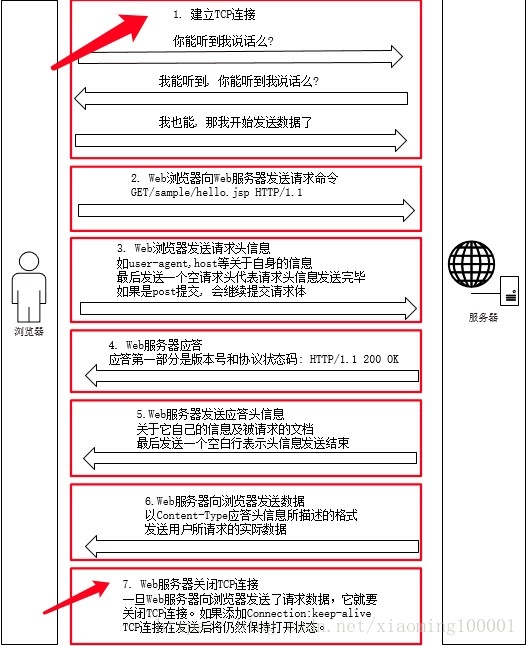
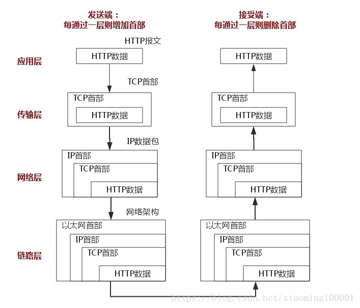

# HTTP 协议

### http2 多路复用

通过单一的 HTTP/2 连接请求发起多重的请求响应消息，多个请求 stream 共享一个 tcp 链接，实现多留并行而不是依赖建立多个 TCP 链接。

### HTTP 特点

1. 无状态：协议对客户端没有状态存储，对事物处理没有记忆能力，比如登录一个网站需要反复进行登录操作
2. 无连接：在 http/1.1 之前，由于无状态特点，每次请求都需要通过三次握手，四次挥手，和服务器重新建立连接。比如某个客户机在短时间多次请求同一个资源，服务器并不能区别是否已经响应过用户的请求，所以每次需要重新请求，需要消耗不必要的时间和流量。
3. 基于请求和响应：基本的特性，客户端发起请求，服务端响应
4. 简单快速，灵活
5. 通信使用明文，请求和响应不会对通信方进行确认，无法保护数据的完整性

针对无状态的一些解决策略：

场景：逛电商商场用户需要使用的时间比较长，需要对用户一段时间的 HTTP 通信状态进行保存，比如执行一次登陆操作，30 分钟内所有的请求都不需要再次登陆

1. 使用 Cookie/Session 技术
2. HTTP/1.1 持久链接（HTTP keep-alive）方法，只要任意一端没有明确提出断开连接，则保持 TCP 连接状态，在请求首部字段中的 Connection：keep-alive 即为表明使用了持久连接

### HTTPS 特点

基于 HTTP 协议，通过 SSL 或者 TLS 提供加密处理数据、验证对方身份以及数据完整性保护

1. 内容加密：采用混合加密的技术，中间者无法直接查看明文内容
2. 验证身份：通过证书认证客户端访问的是自己的服务器
3. 保护数据完整性：防止传输的内容被中间人冒充或者篡改

### HTTP 通信传输

客户端输入 URL 回车，DNS 解析获取到服务器的 IP 地址，服务器在 80 端口监听客户端请求，端口通过 TCP/IP 协议建立连接。HTTP 属于 TCP/IP 协议的应用层协议，所以通信的过程其实是对应数据的进栈和出栈。

为什么要进行三次握手呢？

为了防止已失效的连接请求报文突然又传送到了服务器，因而产生错误

比如：client 发出的第一个连接请求报文并没有丢失，而是在某个网络节点长时间的滞留了，以致于延误到连接释放以后的某个时间才到达 server。本来就是一个早已失效的报文段，但是 server 收到此失效的连接请求报文段后，就误认为是 client 再次发出的一个新的连接请求，于是就向 client 发出确认报文段，同意建立连接。假设不采用三次握手，那么只要 server 发出确认，新的连接就建立了，由于 client 并没有发出建立连接的请求，因此不会理睬 server 的确认，也不会向 server 发送数据，但 server 会认为新的运输连接已经建立，并一直等待 client 发送过来数据。所以没有三次握手，server 端很多资源就白白浪费了。

为什么需要四次挥手？TCP 是全双工模式，当 client 发出 FIN 报文段的时候，只是表示 client 已经没有数据要发送了，client 告诉 server，它的数据已经发送完毕了，但是这个时候 client 还是可以接收来自 server 的资数据；当 server 返回 ACK 报文段时，表示他已经知道 client 没有数据发送了，但是 server 还是可以发送数据到 client 的；当 server 也发送了 FIN 报文段时，这个时候就表示 server 也没有数据要发送了，就会告诉 client，我也没有数据要发送了，如果收到 client 确认报文段，之后彼此就可以愉快的断开这次 TCP 连接了。

### 浏览器是如何解析 HTML 的

当我们在浏览器地址栏输入一个合法的`url`时，首先进行浏览器 DNS 域名解析，拿到服务器 IP 地址后，浏览器向服务器发送`GET`请求，等到浏览器正常返回后浏览器开始下载并解析 html。

`html`页面主要由`dom`，`css`，`javascript`等部分构成，其中`css`和`javascript`既能内联也能以脚本的形式引入，当然 html 还可能引入 img、iframe 等其他资源。其实所有的这些资源也是以 dom 标签的形式嵌入在 html 中。

1. DOM 解析过程

整个 dom 的解析过程是`顺序`，并且是`渐进式`的

`顺序`是指从第一行开始，一行一行依次进行解析；`渐进式`则指的是浏览器会迫不及待的解析完成的部分显示出来。

既然`dom`是从第一行按顺序解析的，那我们怎么判断`dom`何时解析完成呢？例如

> window.onload 和 DOMContentLoaded 有什么区别？

其实就是想看看 dom 树何时构建完成的，因为我们使用 javascript 操作 dom 或者给 dom 绑定事件有个前提条件就是需要 dom 树已经创建完成。整个 html 页面的 dom 解析完成时，dom 树的也就构建完成了。dom 树构建完成后 document 对象会派发事件 DOMContentLoaded 来通知 dom 树已构建完成。

`html`从第一行开始解析，遇到外联资源（外联 css、外联 javascript、image、iframe 等）就会请求对应资源，那么请求过程是否会阻塞`dom`解析过程呢？答案是看情况，有的资源会，有的资源就不会。下面按是否会阻塞页面解析分为两类：阻塞型与非阻塞型。注意这里区分两类资源的标志是`document`对象派发 DOMContentLoaded 事件的时间节点，认为派发 DOMContentLoaded 才表示 dom 树构建完成

1.1 阻塞型

会阻塞 dom 解析的资源主要包括：

- 内联 css
- 内联 JavaScript
- 外联普通 JavaScript
- 外联 defer JavaScript
- javascript 标签之前的外联 css

外联 JavaScript 可以使用`defer`,`async`表示，因此这里分为了三类：`外联普通JavaScript`，`外联defer JavaScript`，`外联async JavaScript`。dom 解析过程中遇到外联普通 JavaScript 会暂停解析，请求拿到 JavaScript 并执行，然后继续解析 dom 树。

对于外联 defer javascript 为什么是阻塞型，这里以 document 对象派发 DOMContentLoaded 事件来标识 dom 树构建完成，而 defer javascript 实在该事件派发之前请求并执行的，因此也属于阻塞型。但是需要知道的是，defer 的 JavaScript 实际上是 dom 树构建完成与派发 DOMContentLoaded 事件之间请求并执行的。本身 script 也是 dom 的一部分，所以 defer 的 javascript 会在 DOMContentLoaded 派发之前执行了。

另外需要注意的是，JavaScript 标签之前的外联 css，理论上是不会阻塞 dom 解析的，但实际上 dom 树的构建受 JavaScript 的阻塞，而 JavaScript 执行时可能会使用 window.getComputedStyle()之类的 api 获取 dom。  
因此浏览器一般会在遇到 script 标签时将该标签之前的外联 css 请求并执行。

这些阻塞型的资源请求并执行之后 dom 树的解析便完成了，这时 document 对象就会派发 DOMContentLoaded 事件，表示 dom 树构建完成。

1.2 非阻塞型

- javascript 之后的外联 css
- image
- iframe
- 外联 async javascript

非阻塞型的资源加载完成是 window.onload。

2. 外联 javascript 的加载过程

[参考文献](https://blog.csdn.net/xiaoming100001/article/details/81109617)
