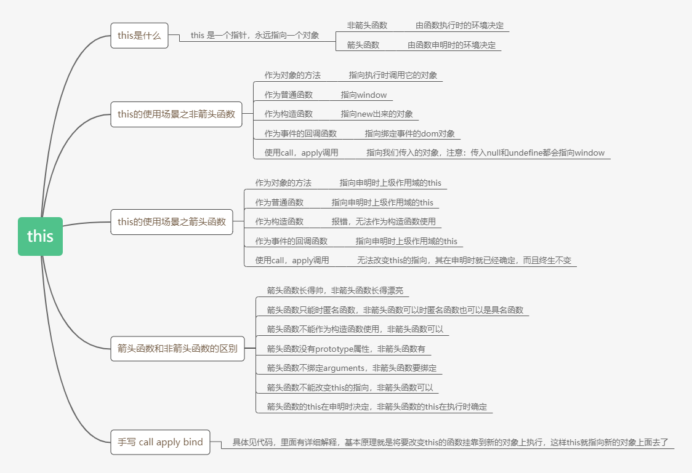

<!--
 * @Author: shdongzhao
 * @Date: 2020-12-21 10:08:25
 * @LastEditors: shidongzhao
 * @LastEditTime: 2020-12-29 17:08:26
 * @Description:
-->

# 面向对象

## 对象属性

对象属性的数据类型包含 4 个

1. [[Configurable]]表示属性是否可以通过 delete 删除并重新定义，是否可以修改他的特性，以及是否可以把他改为访问器属性。默认情况下，所有直接定义在对象上的属性的这个特性都是 true
2. [[Enumerable]] 表示属性是否可以通过 for-in 循环返回。默认是 true
3. [[Writable]] 表示属性的值是否可以被修改
4. [[Value]] 包含属性实际的值，默认是 undefined

要修改属性的默认特性，就必须用 Object.defineProperty()方法。这个方法接收 3 个参数：要给其添加属性的对象，属性的名称和一个描述符对象。最后一个参数,可以为 configurable,enumerable,writable 和 value

需要注意的是，一个属性被定义为不可配置之后，就不能变回可配置的了。

## 访问器属性

访问器属性有 4 个特性描述他们的行为

1. [[Configurable]]
2. [[Enumerable]]
3. [[Get]] 获取函数 默认值是 false
4. [[Set]] 设置函数 默认值是 false

访问器属性是不能直接定义的，必须使用 Object.defineProperty()

不能在两个对象间转移获取函数和设置函数

### 闭包

在 JS 中，变量的作用域属于函数作用域，在函数执行后作用域就会被清理，内存也随之就会被回收，但是由于闭包是建立一个函数内部的子函数，由于其可访问上级作用域的原因，即使上级函数执行完，作用域也不会随之销毁，这时的子函数，也就是闭包，便拥有了访问上级作用域中变量的权限，即使上级函数执行完后作用域内部的值也不会销毁。

### Function 和 Object 的关系

我们知道一般对象是 Object 的实例，因为原型链的顶端都指向 Object.prototype。而 Object 本身也是函数，而任何函数都是 Function 的实例对象，比如 Array,String 等，由此可知，Object 也是 Function 的实例

```js
Object.__proto__ === Function.prototype;
Object.instanceof Function = true
```

同时，Function 也是个对象，他的原型是 Function.\_\_proto\_\_指向 Function.prototype，并且这个原型链向上继续指向 Object.prototype

于是就有了一个蛋鸡问题：

```js
Object instanceof Function === true;
Function instanceof Object === true;
```

我们知道 Object.prototype 是原型链的 root。但首先，现在世界上还没有 Object，更没有 Object.prototype。现在只有个特殊的对象，姑且称它为 root_prototype，里面定义了些基本的 field 和 method 比如 toString 之类的，以后我们要让所有的原型链都最终指向它。注意它没有原型，它的\_\_proto\_\_是 null，这也是它和所有其它 JavaScript 对象的区别，使它与众不同，能有资格成为原型链的 root。

然后定义 Function。先看 Function 的 prototype，我们只要知道这是一个特殊的对象，它的原型\_\_proto\_\_指向刚才的 root_prototype，就是说 Function.prototype.\_\_proto\_\_ === root_prototype，这样它就算连上了原型链的 root。

上面已经讲过了，Function 也是个对象，也有\_\_proto\_\_，指向 Function 自己的 prototype，所以说白了 Function 也是个奇葩，是 JavaScript 里规定的一个特殊的东西。而 Function.prototype 的原型\_\_proto\_\_继续指向 root_prototype，所以 Function 也连上了原型链 root。

所有的函数，什么 Array 之类的，包括 Object 也是函数，都是继承 Function 的，就是说，任意函数 foo.\_\_proto\_\_ === Function.prototype，所以我们自然有 Object instanceof Function。

然后再看 Object，它本来就是个函数而已，和其它函数没什么区别，都继承了 Function。可是现在最关键的一步是，强行设定让 Object.prototype = root_prototype，这样 Object.prototype 就成了原型链的 root！注意这里的逻辑，是先有了 root_prototype，然后规定 Object.prototype 等于它，这一步是人为规定的，这就是 Object 的特殊之处。你要是规定 bar.prototype 也等于 root_prototype，那 bar.prototype 也成了原型链的的顶端。所以 JavaScript 里\_\_proto\_\_这个东西其实是很随意的，放在哪个函数的 prototype 里，哪个函数就成了你爹。

好了现在 Object.prototype === root_prototype 了，成了所有对象原型链的 root。那么由第 3 步的结论，Function 也是对象，是连上了 root_prototype 的，而现在 root_prototype 给 Object.prototype 了，那 Function 自然就是 instanceof Object。

总结一下：

```text
- 首先没有鸡没有蛋，现有一个特殊对象 root_prototype，它是上帝
- 接下来应该是先有Function，并且定义它的prototype和__proto__，都连上了root_prototype
- 然后才有了Object，它是Function的instance，继承了Function，这时候Object还只是普通函数
- 然后规定Object.prototype = root_prototype，这时候Object才显得特殊，成为了原型链的顶端，否则它和其他函数没有任何区别
- 于是所有东西，包括Function，都成了Object的实例了
```

### this

this 是一个指针，并且它永远指向一个对象，对于非箭头函数来说，具体指向哪个对象是在运行时基于函数的执行环境动态绑定的。对于箭头函数来说，具体指向哪个对象是在箭头函数声明时的环境确定的

1. this 的使用场景--非箭头函数

- 作为对象的方法调用
- 作为普通函数调用
- 作为构造函数调用
- 作为事件的回调函数调用
- Function.prototype.call 和 Function.prototype.apply 调用

(1) 作为对象的方法调用

```js
let userName = 'xusong';
let obj = {
  userName: 'shidongzhao',
  sayName() {
    return this.userName;
  },
};
console.log(obj.sayName()); // shidongzhao
```

杰伦：当函数作为对象的方法调用的时候，this 指向该对象

tips: 把对象的方法赋值给一个 var 定义的全局变量,然后再在全局环境下执行会变成 xusong，此时 this 指向 window

(2) 作为普通函数调用

this 指向 window

```js
// 作为普通函数调用
let userName = 'wenyaoyao';
function getName() {
  console.log(this.userName);
}
getName();
//输出 undefined
```

可以发现 let 和 const 定义的变量并不会挂靠到 window 上，然后此时 this 指向的是 window，所以打印的时候是 `undefined`

(3) 作为构造函数去调用

```js
function Person() {
  this.userName = 'longhanghang';
  //return this;
}

let person1 = new Person();
console.log(person1.userName);
```

杰伦：当使用 new 运算符调用函数时总会返回一个对象，this 指向这个对象。

函数内部区分一个函数的调用类型：

```js
// 函数内判断调用类型
let obj = {};
function gudgeType() {
  if (this instanceof gudgeType) {
    console.log('构造函数调用');
  } else {
    console.log('其他方式调用');
  }
}

gudgeType();
new gudgeType();
// 输出其他方式调用
// 构造函数调用
```

(4) 作为事件的回调函数调用

```html
<!DOCTYPE html>
<html lang="en">
  <head>
    <meta charset="UTF-8" />
    <meta name="viewport" content="width=device-width, initial-scale=1.0" />
    <title>作为事件的回调函数使用</title>
  </head>
  <body>
    <div id="test">点击我</div>
  </body>
  <script type="text/javascript">
    //作为事件的回调函数使用
    var testDom = document.querySelector('#test');
    test.onclick = function (e) {
      console.log(this);
    };
  </script>
</html>
// 输出
<div id="test">点击我</div>
```

以上代码运行结果是`<div id="test">点击我</div>`

作为事件的回调函数调用的时候，this 指向绑定事件的 dom 对象

tips:如果在回调函数再定义一个函数，this 会指向 window

(5) Function.prototype.call 和 Function.prototype.apply 调用

```js
//Function.prototype.call()

function getName(name, age) {
  console.log(this.name, name, age);
}
var obj = {name: 'longhanghang'};
getName.call(obj, 'wenyaoyao', 11);

//输出为 longhanghang wenyaoyao 11
```

```js
//Function.prototype.apply()

function getName(name, age) {
  console.log(this.name, name, age);
}
var obj = {name: 'longhanghang'};
getName.apply(obj, ['wenyaoyao', 11]);

//输出为 longhanghang wenyaoyao 11
```

call 和 apply 指向第一个参数，且优先级高于作为对象的方法调用

箭头函数和非箭头函数的区别

- 箭头函数都是匿名函数，非箭头函数可以是匿名函数也可以是具名函数
- 箭头函数不能使用 new 关键字，非箭头函数可以
- 箭头函数没有 prototype 属性，非箭头函数有
- 箭头函数不绑定 arguments，非箭头函数要绑定
- 箭头函数无法使用 call 和 apply 修改的 this 的指向，非箭头函数可以
- 箭头函数的 this 在申明时决定，非箭头函数的 this 在执行时确定

### 手写 call,apply,bind

详见 index.js


