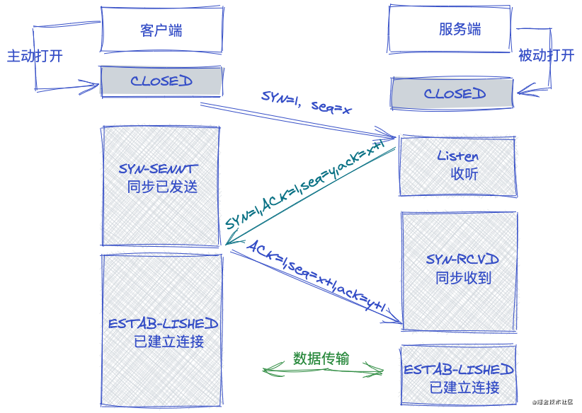
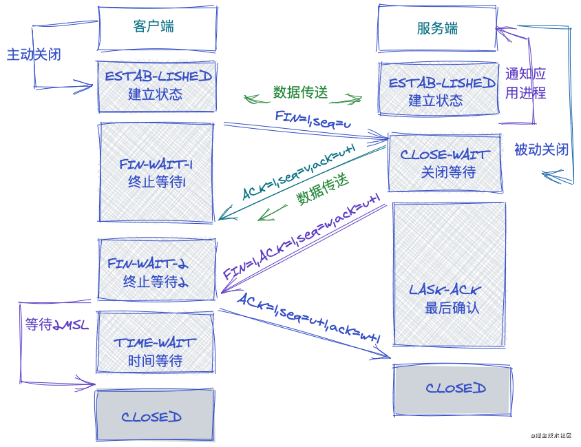

# 常见的面试题

从输入 URL 地址到看到页面

一共七步：

- URL 解析
- 缓存检查
- DNS 解析
- TCP 三次握手
- 数据传输
- TCP 四次挥手
- 页面渲染

第一步：url 解析

1. 地址解析，URL 编码

第二步：缓存检查

> 缓存位置：内存缓存（Memory Cache）、硬盘缓存（Disk Cache）

- 打开网页：查找 Disk Cache 中是否有匹配，如果有则使，如果没有则发送网络请求
- 普通刷新：Memory Cache 可用会被优先使用，其次是 Disk Cache
- 强制刷新：不使用缓存，会在请求头带有 Cache-control: no-cahce

强缓存：

浏览器对于强缓存的处理：根据第一次请求资源返回的响应头来判断

- Expires 缓存过期时间，用来指定资源到期的时间（HTTP/1.0）
- Cache-Control: 第一次拿到资源后的时间内，再次发送请求，读取缓存中的信息(HTTP/1.1)
- 两者同时存在，Cache-Control 优先级高于 Expires

- 优势：减少对服务器的请求，加载资源更快，页面渲染速度更快
- 弊端：当我们的资源在服务器更新了，但是本地还是有缓存的，这样导致客户端无法及时获取最新的资料

解决方案：

- HTML 页面不做缓存，每一次发布资源的时候，内容有更新，资源文件名字都是不一样的 [webpack 名字设置 HASH]，这样页面请求的资源文件也就变了，客户端做过此新文件的缓存，还是从服务器获取
- 哪怕文件名字不变，只要在请求资源文件的后面加一个时间戳也是可以的，这样也是重新获取，而不是走缓存
- 不做强缓存的设置，基于协商缓存实现（真实项目中，往往是两者同时设置的）

协商缓存：协商缓存就是强制缓存失效后，浏览器携带缓存标识向服务器发起请求，由服务器根据缓存标识决定是否使用缓存的过程

- 协商缓存生效，返回 304 和 Not modified
- 协商缓存失败，返回 200 和请求结果

- Last-Modified If-Modified-Since

  (1) 第一次访问资源，服务器返回资源的同时，响应头中设置 Last-Modified（服务器上最后的修改时间），浏览器接收后，缓存文件和响应头

  (2) 下一次请求这个资源，浏览器检测到有 Last-Modified，于是添加 If-Modified-Since 请求头，值就是 Last-Modified 的值

  (3) 服务器再次收到这个资源请求，会根据 If-Modified-Since 中的值与服务器中这个资源的最后修改时间对比，如果没有变化，返回 304 和空的响应体，直接从缓存读取，如果 If-Modified-Since 的值小于服务器中这个资源的最后修改时间，说明文件有更新，于是返回新的资源文件和 200

  (4) 但是 Last-Modified 只能以秒计时，如果在不可感知的时间内修改完成文件，那么服务端会认为资源还是命中了，不会返回正确的资源

- ETag 和 If-None-Match

  (1) Etag 是服务器的响应请求时，返回当前资源文件的一个唯一标识(由服务器生成)，只要资源有变化，Etag 就会重新生成

  (2) 下一次加载资源向服务器发送请求时，会将上一次返回的 ETag 值放到请求头 If-None-Match 里，服务器只需要比较客户端传来的 If-None-Match 跟自己服务器上该资源的 ETag 是否一致，就能很好的判断资源相对客户端而言是否被修改过了

  (3) 如果服务器发现 ETag 匹配不上，那么直接以常规 GET200 回包形式将新的资源(当然也包括了新的 ETag)发给客户端

第三步：DNS 解析

- 部署服务器后，服务器有一个外网 IP 地址，基于外网工 P 可以找到服务器
- 外网 IP 别人记不住，但是可以记得住“域名”
- 域名解析服务器 DNS：记录了域名主机地址(外网 IP)相对应的记录信息 www.baidu.com -> 127.0.0.1
- “DNS 解析”就是根据浏览器识别出来的 URL 地址中的域名，到 DNS 服务器上，查找服务器外网 IP 的过程 (1) DNS 解析也是有缓存的：浏览器解析过一次，一般就会在本地记录一下解析记录 (2) 所以每一次 DNS 解析：本地 DNS 服务器解析(递归)、根/顶级/权威域名服务器解析(迭代)

优化：

- 减少 DNS 请求次数

  页面中尽可能少用过多域名

  服务器部署资源还有更大的好处，服务器使用合理化，HTTP 有并发性，但是它的并发性是受到源的限制的，同一个源一次最多并发 4~7 个；如果我们分开部署，就会存在很多源，同时可以并发的 HTTP 数量也会增多，所以大公司服务器基本上都市分开部署的（尤其是图片等富媒体资源服务器）

- DNS 预获取（DNS Prefetch）

  在不能減少 DNS 解析记录的情况下，我们可以把 DNS 预解析(解析完成先缓存起来)

  ```html
  <link rel="dns-prefetch" href="//g.alicdn.com" />
  ```

第四步 TCP 三次握手

概念：

1. seq 序号,用来标识从 TCP 源端向目的端发送的字节流，发起方发送数据时对此进行标记
2. ack 确认序号, 只有 AcK 标志位为 1 时，确认序号字段才有效，ack=seq+1
3. 标志位：共 6 个，即 URG、ACK、PSH、RST、SYN、FN 等，具体含义如下
   - URG: 紧急指针( urgent pointer)有效
   - ACK: 确认序号有效
   - PSH：接收方应该尽快将这个报文交给应用层
   - oRST: 重置连接
   - SYN: 发起一个新连接
   - FIN: 释放一个连接



第五步 数据传输

HTTP 报文信息

发送数据 HTTP Request

- 起始行，例如：URL、POST / HTTP/1.1
- 请求头（Headers），例如：Authorization、Last-Modified
- 请求主体（body），例如：POST 请求传递信息

发送数据 HTTP Response

- 起始行，例如：网络状态码 HTTP/1.1 404 Not Found。
- 响应头（Headers），例如：服务器时间
- 响应主体（body），例如：客户端需要的信息大部分都在这里

[HTTP 信息](https://developer.mozilla.org/zh-CN/docs/Web/HTTP/Messages)

响应状态码
[HTTP 响应代码](https://developer.mozilla.org/zh-CN/docs/Web/HTTP/Status)

第六步 TCP 四次挥手


Connection： keep-alive 在第一次通信建立好通道之后（TCP 三次握手），服务器端和客户端不会主动关闭通道，这样下一次在发送请求，就无需再次 TCP 三次握手了，节省了网络通信时间

第七步：页面渲染

HTTP1.0 和 HTTP1.1 的一些区别

- 缓存处理 在 HTTP1.0 中主要使用 header 里的 If-Modified-Since，Expires 来做为缓存判断的标准，HTTP1.1 则引入了更多的缓存控制策略例如 Entitytag，If-Unmodified-Since，If-Match，If-None-Match 等更多可供选择的缓存头来控制缓存策略。
- 带宽优化及网络连接的使用 HTP1.0 中，存在一些浪费带宽的现象，例如客户端只是需要某个对象的一部分，而服务器却将整个对象送过来了，并且不支持断点续传功能，HTTP1.1 则在请求头引入了 range 头域，它允许只请求资源的某个部分，即返回码是 206( Partial Content)，这样就方便了开发者自由的选择以便于充分利用带宽和连接。
- 错误通知的管理 在 HTTP1.1 中新增了 24 个错误状态响应码，如 409(Conflict)表示请求的资源与资源的当前状态发生冲突；410(Gone)表示服务器上的某个资源被永久性的删除。
- Host 头处理 在 HTP1.0 中认为每台服务器都绑定一个唯一的地址，因此，请求消息中的 URL 并没有传递主机名( hostname)。但随着虚拟主机技术的发展，在一台物理服务器上可以存在多个虚拟主机( Multi-homed Web Servers)，并且它们共享一个 IP 地址。HTTP1.1 的请求消息和响应消息都应支持 Host 头域，且请求消息中如果没有 Host 头域会报告一个错误(400 Bad Request)
- 长连接 HTTP1.1 支持长连接(PersistentConnection)和请求的流水线(Pipelining)处理，在一个 TCP 连接上可以传送多个 HTTP 请求和响应，减少了建立和关闭连接的消耗和延迟，在 HTTP1.1 中默认开启 Connection：keep-ave，一定程度上弥补了 HTTP1.0 每次请求都要创建连接的缺点。

HTTP2 和 HTTP1.X 相比的新特性

- 新的二进制格式(BinaryFormat) HTTP1.x 的解析是基于文本。基于文本协议的格式解析存在天然缺陷，文本的表现形式有多样性，要做到健壮性考虑的场景必然很多，二进制则不同，只认 0 和 1 的组合。基于这种考虑 HTTP20 的协议解析决定采用二进制格式，实现方便且健壮。
- 多路复用( MultiPlexing) 即连接共享，即每一个 request 都是是用作连接共享机制的。一个 request.对应一个 id，这样一个连接上可以有多个 request.，每个连接的 Request 可以随机的混杂在一起，接收方可以根据 request 的 id 将 reques 再归属到各自不同的服务端请求里面
- header 压缩 如上文中所言，对前面提到过 HTTP1.x 的 header 带有大量信息，而且每次都要重复发送，HTTP2.0 使用 encoder 来减少需要传输的 header 大小，通讯双方各自 cache 一份 header fields 表，既避免了重复 header 的传输，又减小了需要传输的大小
- 服务端推送( server push) 例如我的网页有一个 sytle.css，在客户端收到 sytle.css 数据的同时，服务端会将 sytle.js 的文件推送给客户端，当客户端再次尝试获取 sytle.js 时就可以直接从缓存中获取到，不用再发请求了。

HTTP2.0 的多路复用和 HTTP1.X 中的长连接复用有什么区别?

- HTTP/1.\*：一次请求响应，建立一个连接，用完关闭；每一个请求都要建立一个连接。
- HTTP/1.1 若干个请求排队串行化单线程处理，后面的请求等待前面请求的返回才能获得执行机会，一旦有某请求超时等，后续请求只能被阻塞，毫无办法，也就是人们常说的线头阻塞。
- HTTP/2 多个请求可同时在一个连接上并行执行，某个请求任务耗时严重，不会影响到其它连接的正常执行。

性能优化总结

1. 利用缓存
   (1) 对于静态资源文件实现强缓存和协商缓存（扩展：文件有更新，如何保证及时刷新？）
   (2) 对于不经常更新的接口数据采用本地存储做数据缓存（扩展 cookie/localStorge/vuex|redux 区别）
2. DNS 优化
   (1) 分服务器部署，增加 HTTP 并发性（导致 DNS 解析变慢）
   (2) DNS Perfetch
3. TCP 的三次握手，四次挥手
   Connection：keep-alive
4. 数据传输

   (1) 减少数据传输大小

   - 内容或者数据压缩（webpack 等）
   - 服务器端一定要开启 GZIP 压缩（一般能压缩 60%左右）
   - 大批量数据分批次请求（例如：下拉刷新或者分页，保证首次加载请求数据少）

   (2) 减少 HTTP 请求次数

   - 资源文件合并处理
   - 字体图标
   - 雪碧图 CSS-Sprit
   - 图片的 Base64

5. CDN 服务器 "地域分布式"

6. 采用 HTTP2.0
7. 网络优化师前端性能优化中的重点内容，因为大部分的消耗搜发生在网络层，尤其是第一次页面加载。如何减少等待时间很重要"较少白屏的效果和时间"。Loading 人性化体验、骨架屏：客户端骨屏+服务器骨架屏、图片延迟加载
